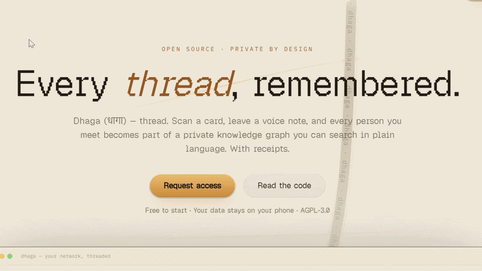
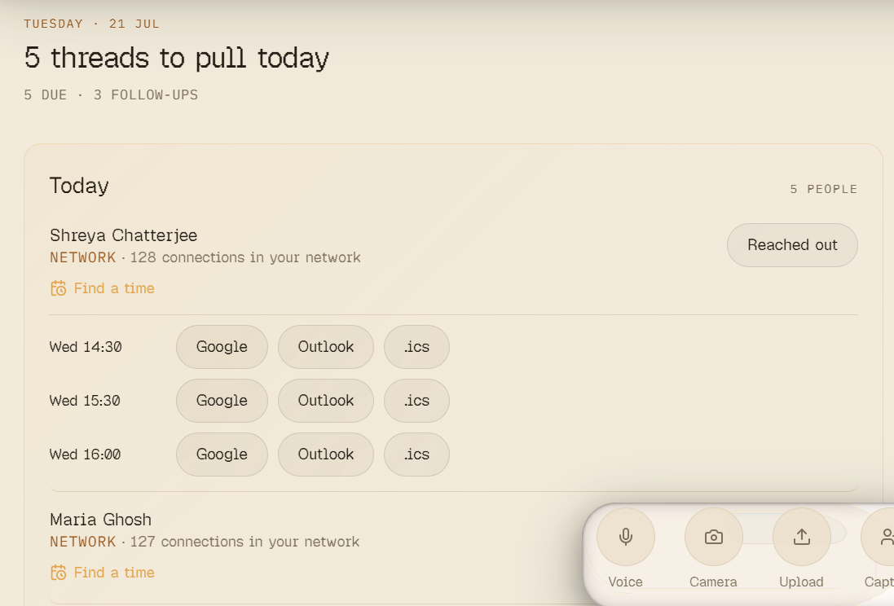
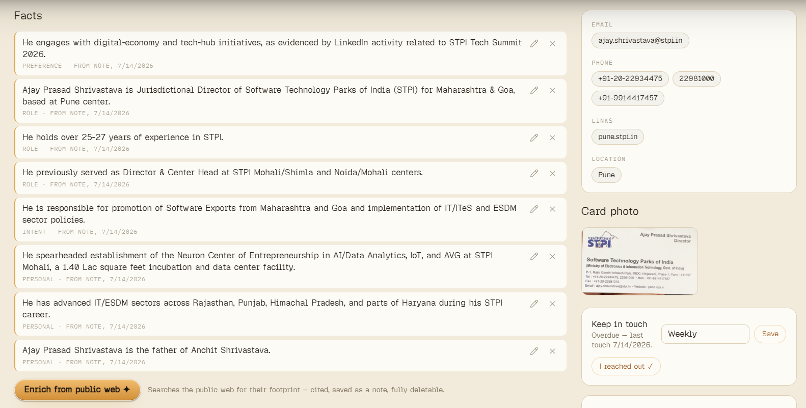
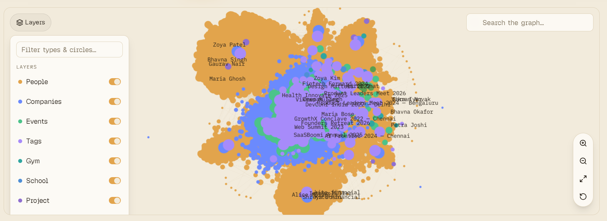
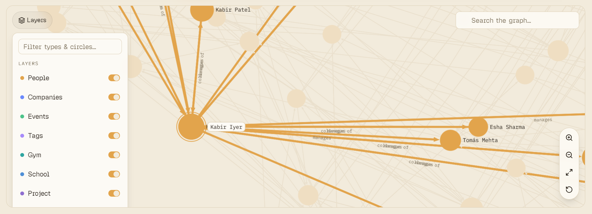
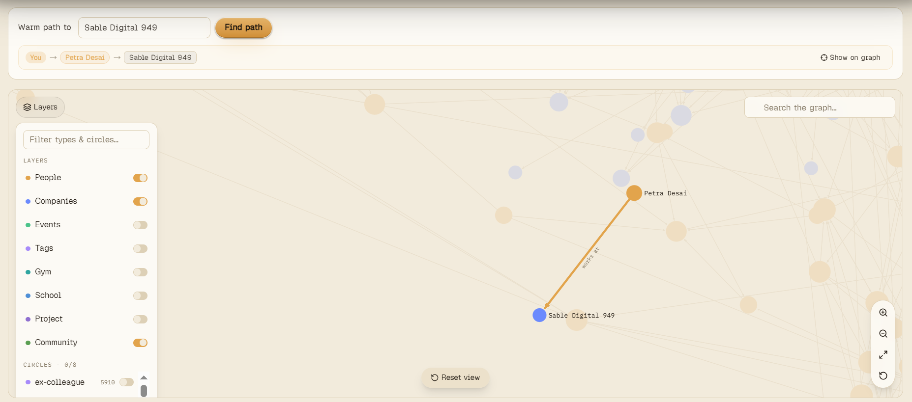
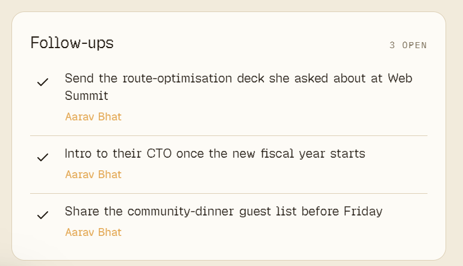
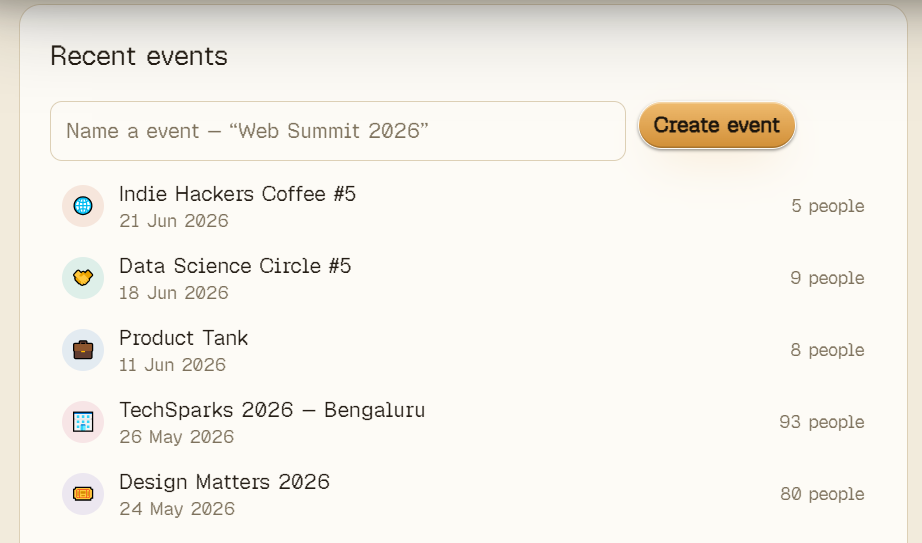

<div align="center">


<h3>धागा · thread</h3>

<h1>Every thread, remembered.</h1>

<p><b>The open-source, AI-native personal CRM.</b><br/>
Scan a card, a badge, or just talk — every person you meet becomes a
<b>private knowledge graph</b> you can search in plain language,<br/>with every
AI-derived fact citing the exact note it came from.</p>

<br/>



<br/><br/>

<a href="docs/assets/dhaga-launch.mp4"><b>▶ Watch the walkthrough</b></a> &nbsp;·&nbsp;
<a href="https://www.dhaga.app/blog/why-i-built-dhaga">Why I built this</a> &nbsp;·&nbsp;
<a href="docs/SELF_HOSTING.md">Self-hosting</a> &nbsp;·&nbsp;
<a href="docs/ROADMAP.md">Roadmap</a> &nbsp;·&nbsp;
<a href="docs/BRD.md">Architecture</a>

<br/><br/>


</div>

---

## The problem

> *"Who did I meet at Web Summit who mentioned an AI budget?"* — an answer, with receipts.

You met **47 people** at your last conference. You followed up with **5**. You'll
remember **3** by next quarter.

Card-scanner apps digitize the contact and lose the context. Personal CRMs sync
your inbox but capture nothing at the moment of meeting. Enterprise relationship
platforms cost $2,000+ per seat. **Dhaga captures at the handshake and remembers
who they are _to you_.**

---

## What it does

### 🧵 &nbsp;Reach out with intent — not guilt

Home opens with the threads worth pulling **today**: who's due, who's fading, what
you promised. Capture anyone in five seconds — voice, camera, upload, or paste —
and Dhaga even suggests a time to meet.



### 🧠 &nbsp;Every fact keeps a receipt

AI reads your notes and — only when you ask — enriches from the public web: role,
company, links, the sailing thing. **Every fact cites the exact note it came
from**, and deleting the note tombstones the fact. Set a keep-in-touch cadence and
Dhaga nudges you when it's time.



### 🕸️ &nbsp;Your whole network, as a living graph

No matter how big your network gets, it stays one navigable graph — people,
companies, events, and every relationship between them.



### 🔍 &nbsp;Find exactly who you want

Toggle layers, filter by circle, search in plain language, and focus any person to
see who they know and how.



### 🛣️ &nbsp;A warm path to anyone

Need an intro to a company you've never met? Dhaga finds the shortest warm path
through the people you already know.



### ✅ &nbsp;Never drop a follow-up — and remember where you met

Note-derived follow-ups and event-based memory, so *"I'll send you that deck"* and
*"we met at Web Summit"* never get lost.

<p>


</p>

---

## Principles

- **Local-first.** Notes, extraction, and search run against your own Postgres
  (embedded PGlite by default, or any hosted Postgres you point it at) — no
  dependency on Dhaga's cloud to function.
- **Private by design.** No scraping, no silent enrichment — every AI call is
  user-triggered and every derived fact keeps a receipt back to its note.
  "Forget this person" cascades everywhere.
- **Leave anytime.** Export your full graph as CSV, vCard, or JSON at any time —
  see [DEPLOYING.md](docs/DEPLOYING.md).
- **Bring your own AI.** Cloud AI (Claude) is optional — without an API key,
  capture falls back to an offline heuristic parser and AI features show a clear
  "not configured" message rather than failing silently.
- **Open-core, not open-crippled.** Everything you need to run Dhaga for
  yourself — accounts, capture, notes, graph, search, drafts, export, Telegram,
  the browser-extension API — is AGPL and runs with zero dependency on any
  proprietary code. See [SELF_HOSTING.md](docs/SELF_HOSTING.md).

---

## Quickstart

```bash
npm install
npm run dev --workspace=web
```

Copy `apps/web/.env.example` to `apps/web/.env.local` and set at least
`BETTER_AUTH_SECRET` (`openssl rand -base64 32`) to run locally — that's enough
for the zero-config embedded-Postgres mode. Add an `ANTHROPIC_API_KEY` to turn on
AI capture, search, and drafts. See [SELF_HOSTING.md](docs/SELF_HOSTING.md) /
[DEPLOYING.md](docs/DEPLOYING.md) for running your own instance (a verified
`docker compose up` path ships in the repo), and [TESTING.md](docs/TESTING.md) for
a full manual test pass.

## Repository layout

```
apps/web/        Next.js — marketing site, the app (/app), API routes
apps/extension/  Browser extension (MV3) — one-click capture
packages/core/   Shared Zod schemas, LLM gateway, extraction prompts
packages/ee/     Dhaga Cloud only — multi-tenancy, billing, admin, early access
                 (source-available, not AGPL — see packages/ee/LICENSE;
                 self-hosting needs none of it, see docs/SELF_HOSTING.md)
apps/mobile/     React Native + Expo — iOS & Android (planned)
docs/BRD.md      Full product requirements, roadmap, competitor analysis
```

## Status

**Pre-launch.** The full MVP loop is built — card/badge scan, voice + text notes,
entity extraction, the knowledge graph, natural-language search, AI follow-up
drafts, and export — plus v1.1+ features (web quick-add, browser extension,
Telegram capture, events, reminders), real multi-user accounts, and a verified
`docker compose up` production path (multi-stage `Dockerfile` + pgvector
`compose.yml`, boot-tested against both Postgres and the zero-config embedded
PGlite mode). Not yet done: the mobile app and a live-tested Stripe billing flow
for Dhaga Cloud.

See [checklist.md](docs/checklist.md) for feature-by-feature status,
[ROADMAP.md](docs/ROADMAP.md) for what's shipped and what's next, and
[BRD.md](docs/BRD.md) for the full product requirements.

Want to help build it? Start with [CONTRIBUTING.md](CONTRIBUTING.md) — setup,
branch/PR workflow, code standards, and the architecture principles that reviews
actually enforce.

## License

[AGPL-3.0](LICENSE) for everything except `packages/ee`, which is source-available
under a separate noncompete license (PolyForm Shield 1.0.0 — see
[`packages/ee/LICENSE`](packages/ee/LICENSE)) and powers Dhaga Cloud's hosted-only
features: multi-tenant isolation, early access, the admin panel, and billing.
Self-hosting needs none of it — see [SELF_HOSTING.md](docs/SELF_HOSTING.md) for
exactly what that means and how to verify it yourself.
